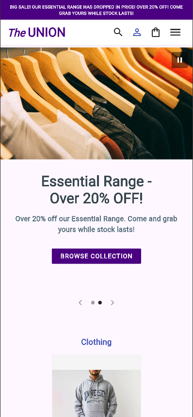
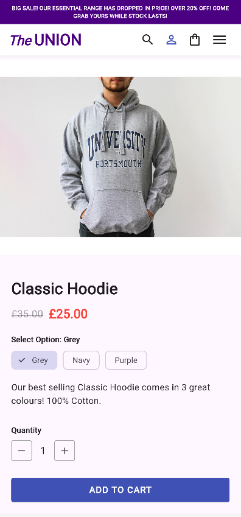
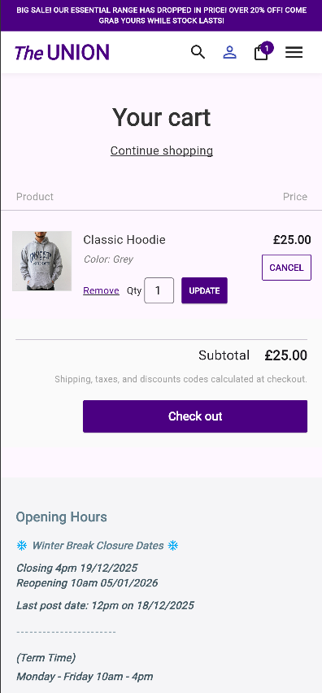

# Union Shop - Flutter E-Commerce App

A cross-platform (Web & Mobile) e-commerce application developed using Flutter, designed to replicate and enhance the functionality of a university student union shop. This project demonstrates modern Flutter development practices, including MVVM architecture, state management with Provider, responsive design, and Firebase backend integration.

## 📱 Project Overview

The Union Shop app allows students and staff to browse university merchandise, manage a shopping cart, and simulate a checkout process. It features a responsive layout that adapts seamlessly between mobile (hamburger menu) and desktop (navigation bar) views.

## Key Features

- **Dynamic Product Catalog**: Browse products by categories (Clothing, Merchandise, etc.) with deep linking support (e.g., `/collection/c_clothing`).
- **Product Details**: View rich product pages with image galleries, price details (including sale logic), and variant selection (size/color).
- **Shopping Cart**: Fully functional cart with persistent state (via Firebase/Local Storage), allowing users to add/remove items and adjust quantities.
- **Search Functionality**: Real-time product search with instant filtering.
- **Authentication**: User Sign Up, Login, and Profile management using Firebase Authentication.
- **Data Persistence**: User carts are stored in Cloud Firestore, ensuring cross-device synchronization for logged-in users.
- **Responsive Design**: Adaptive UI that shifts navigation patterns based on screen width (MobileNavMenu vs DesktopNavBar).
- **Deep Linking**: URL-based navigation for products and collections, enabling easy sharing and page refreshes on the web.

## 🛠️ Tech Stack & Architecture

This project follows the MVVM (Model-View-ViewModel) architectural pattern to separate UI logic from business logic.

- **Framework**: Flutter (Dart)
- **State Management**: Provider
- **Backend**: Firebase
  - **Authentication**: Email/Password login
  - **Cloud Firestore**: Storing user cart data
- **Routing**: Custom `onGenerateRoute` for dynamic path parsing and deep linking
- **Testing**: `flutter_test` for Unit and Widget testing

## Directory Structure

```text
lib/
├── config/          # Configuration files (e.g., Firebase options)
├── data/            # Dummy data sources (for development)
├── models/          # Data models (Product, CartItem)
├── pages/           # UI Screens (HomePage, ProductPage, CartPage)
├── repositories/    # Data layer handling API/DB calls
├── services/        # External services (AuthService)
├── viewmodels/      # State management logic (ShopViewModel, CartViewModel)
├── widgets/         # Reusable UI components (SiteHeader, ProductCard)
└── main.dart        # Entry point and Routing logic
```

## 🚀 Getting Started

### Prerequisites

- Flutter SDK installed
- A Firebase project created with Authentication and Firestore enabled

### Installation

Clone the repository:

```bash
git clone [https://github.com/AmazingKid1998/union_shop.git](https://github.com/AmazingKid1998/union_shop.git)
cd union-shop
```

Install dependencies:

```bash
flutter pub get
```

### Firebase Configuration

1. Create a file: `lib/config/firebase_options.dart`
2. Add your Firebase configuration keys (API Key, App ID, etc.) to this file.  
   > Note: This file is ignored by git for security.

### Run the App

```bash
# For Chrome (Web)
flutter run -d chrome

# For Mobile (Emulator)
flutter run
```

## 🧪 Testing

The project implements a "Safe Testing" strategy that isolates the UI and Logic from external dependencies (Firebase), ensuring tests pass reliably in CI/CD environments.

- **Logic & Unit Tests**: 
  - Validates `Product` model JSON serialization.
  - Tests `ProductRepository` and `ShopViewModel` logic, covering sorting algorithms (Price Low/High, Name A-Z), filtering (Price Ranges), and search capabilities.
  - **Edge Case Handling**: Verified repository fallbacks for invalid IDs and empty collections.
  
- **Widget Tests**: 
  - Verifies the rendering of independent components like `HomeCarousel` and `SiteFooter`.
  - Handles layout constraints (e.g., overflows) using custom viewports and scroll wrappers.

- **Safe Page Integration Tests**: 
  - Tests full screen flows (`CollectionsPage`, `ProductPage`, `SalePage`) without requiring a live Firebase connection.
  - **Dependency Injection**: Utilizes a `MockCartViewModel` (in-memory storage) and injected `testHeaders` to bypass Firebase Auth/Firestore during testing, allowing verification of navigation, product rendering, and "Add to Cart" flows offline.

To run all tests:

```bash
flutter test
```

To generate a coverage report:

```bash
flutter test --coverage
# (Optional) Generate HTML report if you have lcov installed
dart run tool/coverage_summary.dart coverage/lcov.info
```

## 📸 Screenshots

| Home Page (Mobile) | Product Page (Mobile) | Cart & Checkout |
|:---:|:---:|:---:|
|  |  |  |

## 🔮 Future Improvements

- **Payment Integration**: Connect Stripe or PayPal for real payment processing.
- **Admin Panel**: A dedicated interface for adding/removing products without code changes.
- **User Reviews**: Allow students to leave ratings on products.

---

**Author:** Jamilus Sheium

**University:** University of Portsmouth